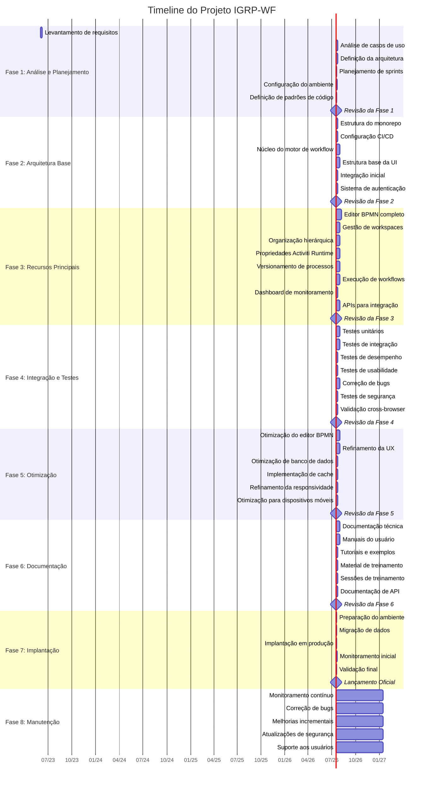

# Plano de Desenvolvimento para Aplicação IGRP-WF

## Sumário Executivo

Este documento apresenta um plano de desenvolvimento detalhado para a aplicação IGRP-WF, um studio de workflow que permite criar e gerenciar workspaces, organizar processos em áreas e definir fluxos de trabalho usando BPMN. O plano abrange todas as fases do projeto, desde o planejamento inicial até a implantação e manutenção contínua, com estimativas de tempo, recursos necessários e estratégias de mitigação de riscos.

## 1. Fases do Projeto

O desenvolvimento da aplicação IGRP-WF será dividido nas seguintes fases:

1. **Análise e Planejamento** (4 semanas)
2. **Desenvolvimento da Arquitetura Base** (6 semanas)
3. **Implementação de Recursos Principais** (12 semanas)
4. **Integração e Testes** (8 semanas)
5. **Otimização e Refinamento** (6 semanas)
6. **Documentação e Treinamento** (4 semanas)
7. **Implantação** (2 semanas)
8. **Manutenção e Suporte** (contínuo)

## 2. Tarefas Específicas

### Fase 1: Análise e Planejamento (4 semanas)
- **1.1** Levantamento detalhado de requisitos funcionais e não funcionais
- **1.2** Análise de casos de uso e fluxos de trabalho
- **1.3** Definição da arquitetura técnica detalhada
- **1.4** Planejamento de sprints e alocação de recursos
- **1.5** Configuração do ambiente de desenvolvimento
- **1.6** Definição de padrões de código e convenções

### Fase 2: Desenvolvimento da Arquitetura Base (6 semanas)
- **2.1** Implementação da estrutura base do monorepo
- **2.2** Configuração do ambiente de build e CI/CD
- **2.3** Desenvolvimento do núcleo do motor de workflow (igrp-wf-engine)
- **2.4** Implementação da estrutura base da UI (igrp-wf-studio-ui)
- **2.5** Integração inicial entre o motor e a UI
- **2.6** Implementação do sistema de autenticação e autorização

### Fase 3: Implementação de Recursos Principais (12 semanas)
- **3.1** Desenvolvimento do editor BPMN completo
- **3.2** Implementação da gestão de workspaces
- **3.3** Desenvolvimento da organização hierárquica (aplicações, áreas, subáreas)
- **3.4** Implementação das propriedades do Activiti Runtime Bundle
- **3.5** Desenvolvimento do sistema de versionamento de processos
- **3.6** Implementação do sistema de execução de workflows
- **3.7** Desenvolvimento do dashboard de monitoramento
- **3.8** Implementação de APIs para integração externa

### Fase 4: Integração e Testes (8 semanas)
- **4.1** Desenvolvimento de testes unitários abrangentes
- **4.2** Implementação de testes de integração
- **4.3** Testes de desempenho e otimização
- **4.4** Testes de usabilidade da interface
- **4.5** Correção de bugs e ajustes
- **4.6** Testes de segurança e penetração
- **4.7** Validação de compatibilidade cross-browser

### Fase 5: Otimização e Refinamento (6 semanas)
- **5.1** Otimização de desempenho do editor BPMN
- **5.2** Refinamento da experiência do usuário
- **5.3** Otimização de consultas e operações de banco de dados
- **5.4** Implementação de cache e estratégias de otimização
- **5.5** Refinamento da responsividade da interface
- **5.6** Otimização para dispositivos móveis (se aplicável)

### Fase 6: Documentação e Treinamento (4 semanas)
- **6.1** Elaboração da documentação técnica completa
- **6.2** Desenvolvimento de manuais do usuário
- **6.3** Criação de tutoriais e exemplos
- **6.4** Preparação de material de treinamento
- **6.5** Realização de sessões de treinamento para equipes internas
- **6.6** Desenvolvimento de documentação de API

### Fase 7: Implantação (2 semanas)
- **7.1** Preparação do ambiente de produção
- **7.2** Migração de dados (se necessário)
- **7.3** Implantação da aplicação em produção
- **7.4** Monitoramento inicial e ajustes pós-implantação
- **7.5** Validação final com usuários-chave

### Fase 8: Manutenção e Suporte (contínuo)
- **8.1** Monitoramento contínuo do sistema
- **8.2** Correção de bugs reportados
- **8.3** Implementação de melhorias incrementais
- **8.4** Atualizações de segurança
- **8.5** Suporte aos usuários

## 3. Timeline

Abaixo está a timeline do projeto em formato Gantt, mostrando a duração e as dependências entre as tarefas:

## 4. Dependências

As principais dependências entre tarefas estão representadas no diagrama Gantt acima. Abaixo estão destacadas algumas dependências críticas:

1. **Dependências da Arquitetura Base**:
   - A implementação dos recursos principais depende diretamente da conclusão da arquitetura base
   - A integração entre o motor e a UI (2.5) depende da conclusão do desenvolvimento do núcleo do motor (2.3) e da estrutura base da UI (2.4)

2. **Dependências dos Recursos Principais**:
   - A implementação das propriedades do Activiti Runtime Bundle (3.4) depende da conclusão do editor BPMN (3.1)
   - O sistema de versionamento (3.5) depende da organização hierárquica (3.3) e das propriedades do Activiti (3.4)
   - O dashboard de monitoramento (3.7) e as APIs (3.8) dependem da implementação do sistema de execução (3.6)

3. **Dependências de Testes e Otimização**:
   - Os testes de integração (4.2) dependem da conclusão dos testes unitários (4.1)
   - A correção de bugs (4.5) depende dos resultados dos testes de desempenho (4.3) e usabilidade (4.4)
   - As otimizações (Fase 5) dependem da conclusão dos testes e correções (Fase 4)

4. **Dependências de Documentação e Implantação**:
   - A documentação (Fase 6) depende da estabilização do sistema após as otimizações (Fase 5)
   - A implantação (Fase 7) depende da conclusão da documentação e treinamento (Fase 6)

## 5. Marcos (Milestones)

Os principais marcos do projeto são:

1. **Aprovação do Plano de Projeto** - Final da Fase 1
   - Requisitos documentados e aprovados
   - Arquitetura definida
   - Plano de desenvolvimento detalhado finalizado

2. **Arquitetura Base Concluída** - Final da Fase 2
   - Estrutura do monorepo configurada
   - Sistema de autenticação implementado
   - Integração inicial entre motor e UI estabelecida

3. **MVP (Minimum Viable Product)** - Meio da Fase 3
   - Editor BPMN funcional
   - Gestão básica de workspaces
   - Organização hierárquica implementada

4. **Recursos Principais Completos** - Final da Fase 3
   - Todas as funcionalidades principais implementadas
   - Sistema de execução de workflows operacional
   - APIs para integração disponíveis

5. **Sistema Testado e Otimizado** - Final da Fase 5
   - Todos os testes concluídos e bugs críticos corrigidos
   - Otimizações de desempenho implementadas
   - Interface refinada e responsiva

6. **Documentação Completa** - Final da Fase 6
   - Documentação técnica e de usuário finalizada
   - Equipes internas treinadas
   - Material de suporte disponível

7. **Lançamento Oficial** - Final da Fase 7
   - Sistema implantado em produção
   - Validação final concluída
   - Início do suporte contínuo

## 6. Recursos Necessários

### Equipe de Desenvolvimento

| Função | Quantidade | Alocação | Fases Principais |
|--------|------------|----------|------------------|
| Gerente de Projeto | 1 | 100% | Todas as fases |
| Arquiteto de Software | 1 | 100% | Fases 1-3, 50% nas demais |
| Desenvolvedor Frontend (React/TypeScript) | 3 | 100% | Fases 2-5 |
| Desenvolvedor Backend | 2 | 100% | Fases 2-5 |
| Especialista em BPMN | 1 | 100% | Fases 2-4 |
| Designer UX/UI | 1 | 100% | Fases 2-3, 5 |
| QA/Tester | 2 | 50% nas Fases 1-3, 100% nas Fases 4-5 | Fases 1-5 |
| DevOps | 1 | 50% | Fases 2, 7, 8 |
| Technical Writer | 1 | 50% na Fase 5, 100% na Fase 6 | Fases 5-6 |

### Infraestrutura e Ferramentas

1. **Ambiente de Desenvolvimento**:
   - Servidores de desenvolvimento
   - Ambientes de CI/CD (Jenkins, GitLab CI ou GitHub Actions)
   - Repositório de código (GitHub, GitLab)
   - Ferramentas de gestão de projeto (Jira, Trello)

2. **Ferramentas de Desenvolvimento**:
   - IDEs (VS Code, WebStorm)
   - Ferramentas de design (Figma, Adobe XD)
   - Ferramentas de modelagem BPMN
   - Ferramentas de teste (Jest, Cypress)

3. **Infraestrutura de Produção**:
   - Servidores de aplicação
   - Banco de dados
   - Serviços de cache
   - Balanceadores de carga
   - Sistemas de monitoramento

## 7. Gerência de Riscos

| Risco | Probabilidade | Impacto | Estratégia de Mitigação |
|-------|--------------|---------|-------------------------|
| Complexidade do editor BPMN maior que o esperado | Alta | Alto | Iniciar o desenvolvimento do editor BPMN o mais cedo possível; considerar a utilização de bibliotecas maduras; alocar desenvolvedores experientes |
| Integração com Activiti Runtime Bundle apresenta desafios técnicos | Média | Alto | Realizar prova de conceito no início do projeto; documentar detalhadamente a integração; manter contato com a comunidade Activiti |
| Desempenho inadequado com diagramas BPMN complexos | Média | Alto | Implementar testes de desempenho desde o início; otimizar renderização; implementar carregamento lazy de componentes |
| Requisitos mudam significativamente durante o desenvolvimento | Média | Médio | Adotar metodologia ágil; realizar revisões frequentes com stakeholders; manter backlog priorizado |
| Dificuldades na experiência do usuário com interface complexa | Alta | Médio | Realizar testes de usabilidade desde o início; envolver designers UX; implementar feedback dos usuários continuamente |
| Atrasos na entrega de componentes críticos | Média | Alto | Identificar o caminho crítico; monitorar de perto as tarefas críticas; ter planos de contingência |
| Problemas de compatibilidade entre navegadores | Baixa | Médio | Definir matriz de suporte a navegadores; implementar testes automatizados cross-browser |
| Dificuldades na migração de dados existentes | Média | Alto | Planejar estratégia de migração antecipadamente; realizar testes de migração em ambiente controlado |
| Segurança inadequada | Baixa | Alto | Implementar revisões de código focadas em segurança; realizar testes de penetração; seguir as melhores práticas de segurança |
| Rotatividade de membros da equipe | Média | Médio | Documentar conhecimento; promover programação em pares; manter documentação técnica atualizada |

## 8. Plano de Testes e Qualidade

### Estratégia de Testes

1. **Testes Unitários**:
   - Cobertura mínima de 80% para o código do motor de workflow
   - Testes automatizados para componentes React
   - Testes de validação para o editor BPMN

2. **Testes de Integração**:
   - Testes end-to-end para fluxos críticos
   - Testes de integração entre o motor e a UI
   - Testes de API

3. **Testes de Desempenho**:
   - Testes de carga para simular múltiplos usuários
   - Testes de desempenho para diagramas BPMN complexos
   - Testes de tempo de resposta para operações críticas

4. **Testes de Usabilidade**:
   - Sessões de teste com usuários reais
   - Análise de heatmaps e gravações de uso
   - Feedback estruturado de usuários-piloto

5. **Testes de Segurança**:
   - Análise estática de código
   - Testes de penetração
   - Verificação de vulnerabilidades conhecidas

### Garantia de Qualidade

1. **Revisão de Código**:
   - Revisão por pares obrigatória para todas as alterações
   - Padrões de codificação documentados e aplicados
   - Uso de ferramentas de análise estática (ESLint, SonarQube)

2. **Integração Contínua**:
   - Build e testes automatizados para cada commit
   - Ambiente de staging para validação antes da produção
   - Monitoramento de métricas de qualidade

3. **Documentação**:
   - Documentação técnica atualizada continuamente
   - Comentários de código para partes complexas
   - Documentação de API gerada automaticamente

4. **Métricas de Qualidade**:
   - Monitoramento de bugs por módulo
   - Tempo médio para resolução de problemas
   - Satisfação do usuário
   - Desempenho do sistema em produção

5. **Processo de Liberação**:
   - Checklists de verificação pré-lançamento
   - Testes de regressão automatizados
   - Processo de rollback definido
   - Monitoramento pós-implantação

---

Este plano de desenvolvimento fornece uma estrutura abrangente para o desenvolvimento da aplicação IGRP-WF. Ele pode ser ajustado conforme necessário durante o ciclo de vida do projeto, especialmente em resposta a mudanças nos requisitos ou desafios técnicos imprevistos. A adoção de uma metodologia ágil permitirá que a equipe responda de forma flexível a essas mudanças, mantendo o foco na entrega de valor para os usuários finais.