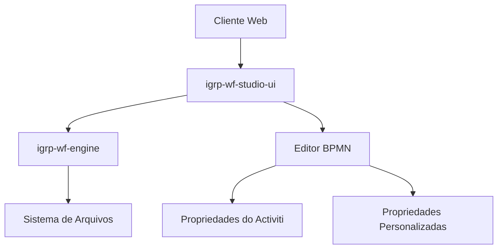
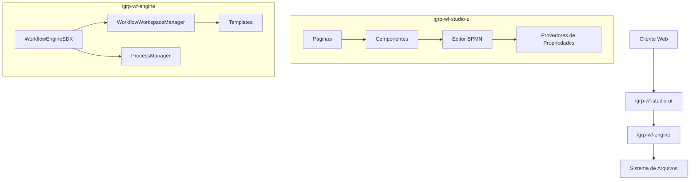
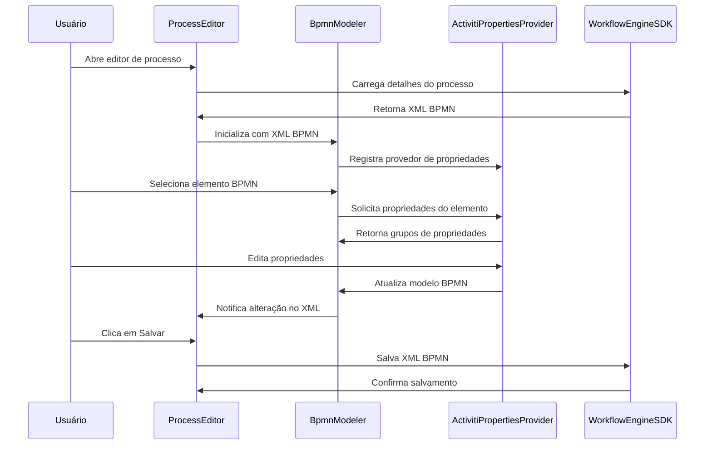
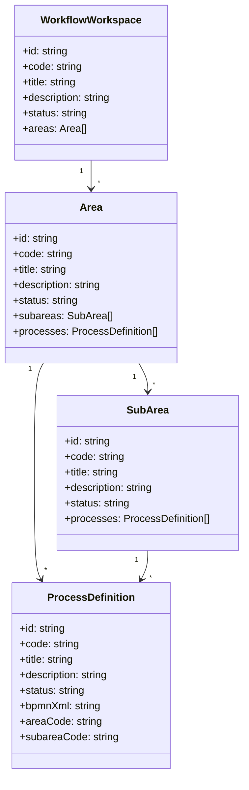

# Manual do Desenvolvedor - IGRP-WF

## Índice

1. [Introdução](#introdução)
2. [Visão Geral da Arquitetura](#visão-geral-da-arquitetura)
3. [Estrutura do Código](#estrutura-do-código)
4. [Componentes Principais](#componentes-principais)
5. [Implementação das Propriedades do Activiti Runtime Bundle](#implementação-das-propriedades-do-activiti-runtime-bundle)
6. [Extensão da Aplicação](#extensão-da-aplicação)
7. [Configuração e Implantação](#configuração-e-implantação)
8. [Diagramas de Arquitetura e Fluxo de Dados](#diagramas-de-arquitetura-e-fluxo-de-dados)

## Introdução

IGRP-WF é um studio de workflow que permite criar e gerenciar workspaces, organizar processos em áreas e definir fluxos de trabalho usando BPMN (Business Process Model and Notation). A aplicação integra-se com o Activiti Runtime Bundle para fornecer recursos avançados de execução de processos de negócios.

Este manual é destinado aos desenvolvedores que desejam entender a arquitetura da aplicação, estender suas funcionalidades ou contribuir para o seu desenvolvimento.

## Visão Geral da Arquitetura

A aplicação IGRP-WF é composta por dois pacotes principais:

1. **igrp-wf-engine**: Biblioteca core que fornece a lógica de negócios para gerenciamento de workspaces, áreas, subáreas e processos.
2. **igrp-wf-studio-ui**: Interface de usuário baseada em React que permite a interação com o engine e a edição visual de processos BPMN.

A arquitetura segue um padrão de design modular, onde:

- O engine fornece uma API para gerenciar a estrutura organizacional dos processos
- A UI consome essa API e fornece uma interface visual para edição de processos
- O editor BPMN é baseado no bpmn-js com extensões personalizadas para suportar propriedades do Activiti



## Estrutura do Código

### Estrutura do Projeto

```
igrp-wf/
├── packages/
│   ├── igrp-wf-engine/
│   │   ├── src/
│   │   │   ├── core/
│   │   │   ├── types/
│   │   │   └── utils/
│   │   └── package.json
│   └── igrp-wf-studio-ui/
│       ├── src/
│       │   ├── bpmn/
│       │   ├── components/
│       │   │   ├── bpmn/
│       │   │   ├── layout/
│       │   │   ├── ui/
│       │   │   └── workspaces/
│       │   ├── lib/
│       │   └── pages/
│       └── package.json
└── package.json
```

### igrp-wf-engine

O engine é responsável por:

- Gerenciar workspaces, áreas, subáreas e processos
- Ler e escrever definições de processos BPMN
- Fornecer templates para criação de novos elementos

Principais arquivos:
- `core/workflowWorkspace.ts`: Gerencia workspaces, áreas, subáreas e processos
- `core/processManager.ts`: Gerencia definições de processos BPMN
- `core/templates.ts`: Fornece templates para criação de novos elementos

### igrp-wf-studio-ui

A UI é responsável por:

- Fornecer uma interface visual para interação com o engine
- Fornecer um editor BPMN com suporte a propriedades do Activiti
- Gerenciar o estado da aplicação

Principais arquivos:
- `components/bpmn/BpmnModeler.tsx`: Componente React que encapsula o editor BPMN
- `components/bpmn/ActivitiPropertiesProvider.ts`: Provedor de propriedades do Activiti
- `pages/ProcessEditor.tsx`: Página de edição de processos

## Componentes Principais

### WorkflowEngineSDK

O `WorkflowEngineSDK` é a classe principal que fornece acesso a todas as funcionalidades do engine:

```typescript
export class WorkflowEngineSDK {
  private basePath: string;
  public workspaces: WorkflowWorkspaceManager;
  public processes: ProcessManager;

  constructor(basePath: string = './') {
    this.basePath = basePath;
    this.workspaces = new WorkflowWorkspaceManager(basePath);
    this.processes = new ProcessManager(basePath);
  }

  setBasePath(basePath: string): void {
    this.basePath = basePath;
    this.workspaces.setBasePath(basePath);
    this.processes.setBasePath(basePath);
  }
}
```

### BpmnModeler

O `BpmnModeler` é um componente React que encapsula o editor BPMN e integra os provedores de propriedades:

```typescript
const BpmnModeler: React.FC<BpmnModelerProps> = ({ xml, onChange }) => {
  // ...
  
  useEffect(() => {
    if (!containerRef.current || !propertiesPanelRef.current) return;

    const modeler = new BpmnJS({
      container: containerRef.current,
      propertiesPanel: {
        parent: propertiesPanelRef.current
      },
      additionalModules: [
        BpmnPropertiesPanelModule,
        BpmnPropertiesProviderModule,
        {
          __init__: ['customPropertiesProvider'],
          customPropertiesProvider: ['type', CustomPropertiesProvider]
        },
        {
          __init__: ['activitiPropertiesProvider'],
          activitiPropertiesProvider: ['type', ActivitiPropertiesProvider]
        }
      ],
      moddleExtensions: {
        camunda: camundaModdleDescriptor,
        custom: customModdleDescriptor,
        activiti: activitiModdleDescriptor
      },
      // ...
    });
    
    // ...
  }, [xml]);
  
  // ...
};
```

### ProcessEditor

O `ProcessEditor` é uma página React que permite a edição de processos BPMN:

```typescript
const ProcessEditor: React.FC = () => {
  const { id } = useParams<{ id: string }>();
  const navigate = useNavigate();
  const [bpmnXml, setBpmnXml] = useState<string>();
  const [processDetails, setProcessDetails] = useState<ProcessDetails | null>(null);
  
  // ...
  
  return (
    <div className="flex flex-col h-[calc(100vh-4rem)]">
      {/* ... */}
      <div className="flex-1 bg-gray-50 min-h-0">
        <BpmnModeler xml={processDetails?.bpmnXml} onChange={setBpmnXml} />
      </div>
    </div>
  );
};
```

## Implementação das Propriedades do Activiti Runtime Bundle

A implementação das propriedades do Activiti Runtime Bundle é feita através de três componentes principais:

1. **activiti.json**: Descritor moddle do Activiti que define os tipos e propriedades suportados
2. **ActivitiPropertiesProvider.ts**: Provedor de propriedades do Activiti que define os grupos e propriedades a serem exibidos no painel de propriedades
3. **BpmnModeler.tsx**: Integração do provedor de propriedades com o editor BPMN

### Descritor Moddle do Activiti (activiti.json)

O arquivo `activiti.json` define os tipos e propriedades suportados pelo Activiti:

```json
{
  "name": "Activiti",
  "uri": "http://activiti.org/bpmn",
  "prefix": "activiti",
  "xml": {
    "tagAlias": "lowerCase"
  },
  "types": [
    {
      "name": "InOutBinding",
      "superClass": ["Element"],
      "isAbstract": true,
      "properties": [
        {
          "name": "source",
          "isAttr": true,
          "type": "String"
        },
        // ...
      ]
    },
    // ...
  ]
}
```

### Provedor de Propriedades do Activiti (ActivitiPropertiesProvider.ts)

O `ActivitiPropertiesProvider.ts` define os grupos e propriedades a serem exibidos no painel de propriedades:

```typescript
class ActivitiPropertiesProvider {
  // ...
  
  getGroups(element: any) {
    return (groups: any[]) => {
      // Add Activiti specific properties for tasks
      if (is(element, 'bpmn:Task') || is(element, 'bpmn:Activity')) {
        const activitiGeneralGroup = {
          id: 'activitiGeneral',
          label: this.translate('Activiti General'),
          component: ActivitiGeneralGroup,
          element: element
        };
        groups.push(activitiGeneralGroup);
      }
      
      // ...
      
      return groups;
    };
  }
}
```

### Propriedades Suportadas

O provedor de propriedades do Activiti suporta as seguintes categorias de propriedades:

1. **Propriedades de Execução Assíncrona**:
   - `async`: Execução assíncrona
   - `asyncBefore`: Execução assíncrona antes da atividade
   - `asyncAfter`: Execução assíncrona após a atividade
   - `exclusive`: Execução exclusiva

2. **Propriedades de Implementação de Tarefas de Serviço**:
   - `class`: Classe Java
   - `expression`: Expressão
   - `delegateExpression`: Expressão de delegação
   - `resultVariable`: Variável de resultado

3. **Propriedades de Atribuição de Tarefas de Usuário**:
   - `assignee`: Responsável
   - `candidateUsers`: Usuários candidatos
   - `candidateGroups`: Grupos candidatos
   - `dueDate`: Data de vencimento
   - `priority`: Prioridade
   - `formKey`: Chave do formulário

4. **Propriedades de Call Activity**:
   - `calledElementBinding`: Vinculação do elemento chamado
   - `calledElementVersion`: Versão do elemento chamado
   - `calledElementVersionTag`: Tag de versão do elemento chamado
   - `calledElementTenantId`: ID do tenant do elemento chamado

5. **Propriedades de Processo**:
   - `candidateStarterGroups`: Grupos iniciadores candidatos
   - `candidateStarterUsers`: Usuários iniciadores candidatos
   - `versionTag`: Tag de versão
   - `historyTimeToLive`: Tempo de vida do histórico
   - `isStartableInTasklist`: Pode ser iniciado na lista de tarefas

6. **Propriedades de Multi-Instance**:
   - `asyncBefore`: Execução assíncrona antes da atividade
   - `asyncAfter`: Execução assíncrona após a atividade
   - `failedJobRetryTimeCycle`: Ciclo de tentativas de jobs falhos

7. **Propriedades de Listeners**:
   - Informações sobre listeners de execução e tarefas

## Extensão da Aplicação

### Adicionando Novos Provedores de Propriedades

Para adicionar um novo provedor de propriedades, siga os seguintes passos:

1. Crie um arquivo de descritor moddle (ex: `myextension.json`) que define os tipos e propriedades suportados:

```json
{
  "name": "MyExtension",
  "uri": "http://myextension.org/bpmn",
  "prefix": "myext",
  "xml": {
    "tagAlias": "lowerCase"
  },
  "types": [
    {
      "name": "MyType",
      "extends": ["bpmn:Task"],
      "properties": [
        {
          "name": "myProperty",
          "isAttr": true,
          "type": "String"
        }
      ]
    }
  ]
}
```

2. Crie um provedor de propriedades (ex: `MyExtensionPropertiesProvider.ts`):

```typescript
class MyExtensionPropertiesProvider {
  constructor(propertiesPanel, translate, moddle, bpmnFactory, commandStack, elementRegistry) {
    this.translate = translate;
    // ...
    
    propertiesPanel.registerProvider(LOW_PRIORITY, this);
  }
  
  getGroups(element) {
    return (groups) => {
      if (is(element, 'bpmn:Task')) {
        const myExtensionGroup = {
          id: 'myExtension',
          label: this.translate('My Extension'),
          component: MyExtensionGroup,
          element: element
        };
        groups.push(myExtensionGroup);
      }
      
      return groups;
    };
  }
}

function MyExtensionGroup(props) {
  // ...
  
  return [
    {
      id: 'myProperty',
      component: MyPropertyComponent,
      getValue: () => getMyExtensionAttribute('myProperty') || '',
      setValue: (value) => setMyExtensionAttribute('myProperty', value),
      translate
    }
  ];
}

function MyPropertyComponent(props) {
  const { id, getValue, setValue, translate } = props;
  
  return TextFieldEntry({
    element: { id },
    id: id,
    label: translate('My Property'),
    description: translate('Description of my property'),
    getValue: () => getValue(),
    setValue: (value) => setValue(value)
  });
}
```

3. Registre o provedor de propriedades e o descritor moddle no `BpmnModeler.tsx`:

```typescript
import myExtensionModdleDescriptor from './myextension.json';
import MyExtensionPropertiesProvider from './MyExtensionPropertiesProvider';

// ...

const modeler = new BpmnJS({
  // ...
  additionalModules: [
    // ...
    {
      __init__: ['myExtensionPropertiesProvider'],
      myExtensionPropertiesProvider: ['type', MyExtensionPropertiesProvider]
    }
  ],
  moddleExtensions: {
    // ...
    myext: myExtensionModdleDescriptor
  }
});
```

### Adicionando Novos Componentes de UI

Para adicionar novos componentes de UI, siga os seguintes passos:

1. Crie um novo componente React:

```typescript
import React from 'react';

interface MyComponentProps {
  // ...
}

const MyComponent: React.FC<MyComponentProps> = (props) => {
  // ...
  
  return (
    <div>
      {/* ... */}
    </div>
  );
};

export default MyComponent;
```

2. Importe e utilize o componente onde necessário:

```typescript
import MyComponent from './MyComponent';

// ...

return (
  <div>
    <MyComponent {...props} />
  </div>
);
```

## Configuração e Implantação

### Requisitos

- Node.js 14+
- npm ou yarn

### Instalação

1. Clone o repositório:

```bash
git clone <repository-url>
cd igrp-wf
```

2. Instale as dependências:

```bash
npm install
```

3. Construa os pacotes:

```bash
npm run build
```

### Configuração

A aplicação pode ser configurada através de variáveis de ambiente ou arquivos de configuração:

- `IGRP_WF_BASE_PATH`: Caminho base para armazenamento de workspaces e processos
- `IGRP_WF_LOG_LEVEL`: Nível de log (debug, info, warn, error)

### Implantação

1. Construa a aplicação para produção:

```bash
npm run build
```

2. Inicie a aplicação:

```bash
npm start
```

## Diagramas de Arquitetura e Fluxo de Dados

### Arquitetura da Aplicação



### Fluxo de Dados para Edição de Processos



### Estrutura de Dados



---

Este manual fornece uma visão geral da arquitetura da aplicação IGRP-WF, seus componentes principais e como estendê-la. Para mais detalhes, consulte a documentação do código-fonte e os comentários no código.
