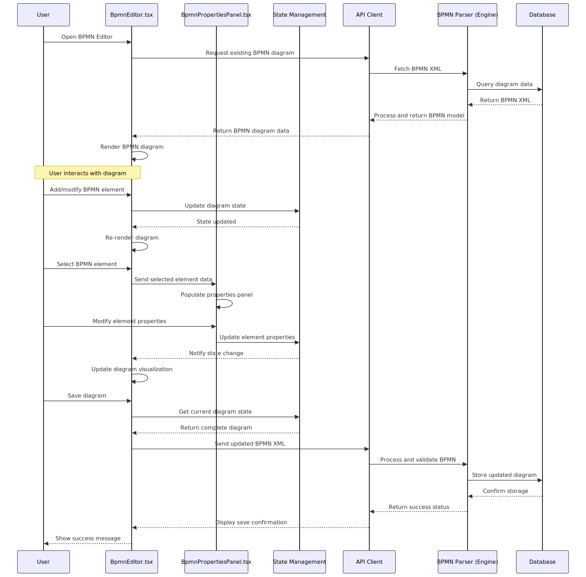
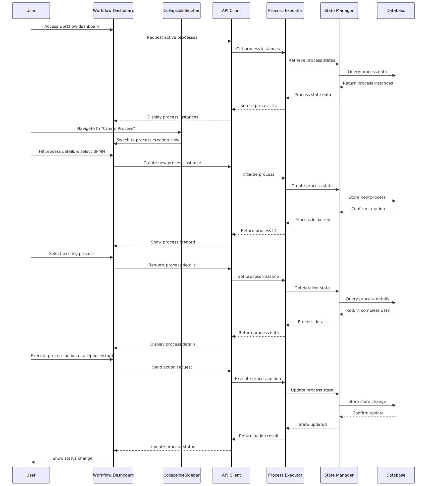

# Especificações Técnicas da Aplicação IGRP Workflow

## 1. Introdução

A aplicação IGRP Workflow (IGRP-WF) é um sistema abrangente de gestão de fluxos de trabalho projetado para modelar, executar e monitorar processos de negócio utilizando o padrão BPMN 2.0. A aplicação segue uma estrutura de monorepo com dois pacotes principais:

- **igrp-wf-engine**: A biblioteca do motor de workflow principal, implementada em Node.js e TypeScript. É responsável pela lógica de negócio de criação e gestão de workspaces (diretórios e ficheiros de configuração como `project-config.json`, `app-options.json`), áreas, sub-áreas e definições de processos (ficheiros BPMN XML) no sistema de ficheiros. Expõe sua funcionalidade através do `WorkflowEngineSDK`.
- **igrp-wf-studio-ui**: A aplicação de interface de utilizador (Next.js, React, TypeScript) que fornece a interface visual para o design e gestão de workflows. Contém componentes de UI, serviços do lado do cliente como `EditorService.ts` (para operações de carregar/salvar diagramas BPMN) e `workspaceManager.ts` (para gerir a estrutura de workspaces, áreas, etc.), que por sua vez utiliza o `WorkflowEngineSDK` do pacote `igrp-wf-engine` e o `workspaceCatalog.ts` para gestão de caminhos de workspaces.

Este documento fornece especificações técnicas detalhadas para a aplicação IGRP-WF, incluindo diagramas de arquitetura, relacionamentos entre componentes, fluxos de trabalho principais e considerações de implantação.

## 2. Stack Tecnológica

### 2.1 Frontend (igrp-wf-studio-ui)

- **Framework**: Next.js (React.js) com TypeScript
- **Gestão de Estado**: React Context/Hooks (Redux pode ser usado em módulos específicos, se necessário)
- **Componentes UI**: Componentes personalizados com Tailwind CSS
- **Modelagem BPMN**: Biblioteca bpmn-js
- **Editores Integrados**: JSONForms para formulários, DMN.js para tabelas de decisão (conforme documentado, integração efetiva a ser verificada em detalhe).
- **Comunicação com Engine Lógico**:
    - `workspaceManager.ts`: Orquestra operações de workspace (CRUD de workspaces, áreas, sub-áreas, metadados de processos) utilizando o `WorkflowEngineSDK`.
    - `EditorService.ts`: Manipula o carregamento e salvamento de conteúdo de diagramas BPMN, utilizando o `workspaceManager.ts`.
    - `workspaceCatalog.ts`: Gere o catálogo de workspaces (`~/.igrp_wf_studio/workspaces_catalog.json`) para mapear códigos de workspace para os seus caminhos base no sistema de ficheiros.
- **Ferramentas de Build**: Next.js CLI (que utiliza Webpack e Babel internamente)
- **Testes**: Jest, React Testing Library (ou equivalentes como Playwright/Cypress para testes E2E)

### 2.2 Engine (igrp-wf-engine)

- **Linguagem**: Node.js com TypeScript
- **API Exposta**: `WorkflowEngineSDK` (consumido programaticamente pelo `igrp-wf-studio-ui`).
    - `WorkflowWorkspaceManager`: Contém a lógica para criar, ler, atualizar e deletar workspaces (estrutura de diretórios, `app-options.json`, `project-config.json`), áreas, sub-áreas e os metadados das definições de processo.
    - `ProcessManager`: Contém a lógica para ler e escrever os ficheiros BPMN XML dentro da estrutura de diretórios de um workspace.
- **Interação Primária de Persistência**: Sistema de ficheiros local.
- **Testes**: Jest (e Supertest se o SDK tivesse uma camada HTTP, o que não é o caso para consumo direto).

### 2.3 Persistência de Dados

- **Estrutura de Workspaces e Processos**: Armazenada diretamente no sistema de ficheiros. Cada workspace é um diretório, contendo:
    - `app-options.json`: Metadados do workspace.
    - `project-config.json`: Configuração do projeto, incluindo definições de áreas, sub-áreas e processos.
    - Subdiretórios para áreas, sub-áreas, que por sua vez contêm os ficheiros `.bpmn` das definições de processo.
- **Catálogo de Workspaces**: Um ficheiro JSON (`~/.igrp_wf_studio/workspaces_catalog.json`) atua como um índice global, mapeando os códigos dos workspaces para os seus caminhos de base (`basePath`) no sistema de ficheiros. Gerido pelo `workspaceCatalog.ts` na UI.
- **PostgreSQL/Cache (Redis)**: Mencionados na documentação original. Se utilizados, seriam para funcionalidades além do design e gestão de estrutura de processos (e.g., motor de execução, dados históricos de execução), não diretamente envolvidos na lógica de design do Studio analisada.

## 3. Arquitetura do Sistema

A aplicação IGRP-WF segue uma arquitetura modular. O `igrp-wf-studio-ui` (frontend) é responsável pela apresentação e interação com o utilizador. Inclui uma camada de lógica de cliente (`workspaceManager.ts`, `EditorService.ts`) que consome o `WorkflowEngineSDK` fornecido pelo pacote `igrp-wf-engine`. O `igrp-wf-engine` atua como uma biblioteca, encapsulando toda a lógica de manipulação da estrutura de workspaces e dos ficheiros de processo (BPMN XML) no sistema de ficheiros.

*Nota: O diagrama de arquitetura do sistema pode precisar de ser atualizado para mostrar explicitamente `workspaceManager.ts` e `EditorService.ts` como componentes chave na UI que fazem a ponte para o `WorkflowEngineSDK`.*

- **igrp-wf-engine**: Contém os gestores principais (`WorkflowWorkspaceManager`, `ProcessManager`) e utilitários para realizar operações no sistema de ficheiros relativas a workspaces, áreas, sub-áreas e ficheiros BPMN. É consumido como uma biblioteca Node.js.
- **igrp-wf-studio-ui**: Contém os componentes de UI React (como o editor BPMN, painéis de propriedades, modais de criação), os serviços do lado do cliente (`EditorService.ts` para operações de diagramas) e o gestor de interações com o engine (`workspaceManager.ts`). O `workspaceManager.ts` utiliza o `workspaceCatalog.ts` para resolver caminhos de workspaces e então instancia e utiliza o `WorkflowEngineSDK`.

A comunicação entre `igrp-wf-studio-ui` e `igrp-wf-engine` é feita por importação direta do SDK (chamadas de função), dado que são pacotes dentro de um monorepo. Não há uma camada de API REST entre o Studio UI e o `igrp-wf-engine` para estas operações de design.

## 4. Diagrama de Componentes

O diagrama de componentes fornece uma visão mais detalhada dos principais componentes dentro de cada pacote e seus relacionamentos.

### 4.1 Componentes de UI (igrp-wf-studio-ui)

- **`BpmnEditor.tsx`**: Fornece a interface visual para criar e editar diagramas BPMN utilizando `bpmn-js`. Interage com `EditorService.ts` para carregar e salvar o conteúdo do diagrama.
- **`BpmnPropertiesPanel.tsx`**: Permite aos utilizadores visualizar e modificar propriedades dos elementos BPMN.
- **`CollapsibleSidebar.tsx`**: Fornece navegação hierárquica (Workspaces, Áreas, Sub-áreas, Processos) e opções de contexto. Utiliza `workspaceManager.ts` para obter dados da estrutura.
- **`WorkspaceListClientContent.tsx` / `WorkspaceDetailsClientContent.tsx`**: Componentes React do lado do cliente que utilizam `workspaceManager.ts` para buscar e apresentar dados de workspaces, áreas, sub-áreas e processos, e para iniciar ações CRUD.
- **Modais (e.g., `CreateWorkspaceModal.tsx`, `CreateProcessModal.tsx`, `CreateAreaModal.tsx`)**: Componentes de UI para entrada de dados na criação de novos elementos da estrutura do workspace. Invocam funções do `workspaceManager.ts`.
- **`EditorService.ts`**: Serviço do lado do cliente que encapsula a lógica para carregar (`loadBpmnContent`) e salvar (`saveBpmnContent`) diagramas BPMN. Delega estas operações para `workspaceManager.ts`, fornecendo os identificadores necessários (workspaceCode, areaCode, processCode, etc.).
- **`workspaceManager.ts`**: Componente central na UI para interagir com a lógica de negócio do `igrp-wf-engine`. Utiliza o `workspaceCatalog.ts` para encontrar o `basePath` de um workspace e então instancia e usa o `WorkflowEngineSDK` para realizar operações de ficheiro e gestão de configuração.
- **`workspaceCatalog.ts`**: Utilitário do lado do cliente para ler e escrever no ficheiro `~/.igrp_wf_studio/workspaces_catalog.json`, que armazena o mapeamento entre `workspaceCode` e `basePath` no sistema de ficheiros.
- **ZoomControls.tsx**: Fornece controles visuais para zoom no canvas BPMN.
- **FormEditorModal.tsx / DecisionEditorModal.tsx**: Editores visuais para formulários e tabelas de decisão (a sua integração e estado de implementação atual necessitam de verificação detalhada).

### 4.2 Componentes do Engine (igrp-wf-engine)

- **`WorkflowEngineSDK`**: Classe principal que serve como ponto de entrada para as funcionalidades do motor. É instanciada pelo `workspaceManager.ts` (na UI) com um `basePath` específico do workspace.
    - **`WorkflowWorkspaceManager`**: Módulo dentro do SDK responsável pelo CRUD de workspaces (criação da estrutura de diretórios, ficheiros `app-options.json`, `project-config.json`), áreas, sub-áreas e os metadados das definições de processo (entradas no `project-config.json`). Opera no sistema de ficheiros relativo ao `basePath` fornecido.
    - **`ProcessManager`**: Módulo dentro do SDK responsável pela leitura (`readProcessDefinition`) e escrita (`saveProcessDefinition`) dos ficheiros BPMN XML. Opera no sistema de ficheiros dentro da estrutura de diretórios de um workspace/área/sub-área.
- **Utilitários de Sistema de Ficheiros**: Funções internas para interagir com o sistema de ficheiros (e.g., `readFile`, `writeFile`, `ensureDir`, `remove`).
- **Templates**: Geradores para criar o conteúdo inicial de `project-config.json`, `app-options.json` e ficheiros BPMN vazios.
- **BPMN Parser/Executor/State Manager**: Mencionados na documentação original como parte do motor. No contexto da ferramenta de *design* (Studio), o `ProcessManager` lida com a persistência do XML BPMN. A execução e gestão de estado seriam relevantes para um motor de execução de processos, que é uma capacidade distinta do Studio de design, mas para o qual o Studio prepara os diagramas.
- **API Layer**: No contexto do `igrp-wf-engine` como uma biblioteca consumida pelo Studio, a "API Layer" é o próprio `WorkflowEngineSDK`. Se o engine fosse um serviço de backend separado, teria uma API REST/RPC.
- **Form Storage Service / Decision Storage Service / Export Service**: Mencionados na documentação original. A sua implementação atual e como se integram com o fluxo de design (para além do BPMN XML) precisaria ser investigada. O `EditorService.ts` atual foca-se no BPMN.

## 5. Diagramas de Sequência

### 5.1 Fluxo de Trabalho de Edição de Diagrama BPMN

O seguinte diagrama de sequência ilustra o fluxo de trabalho para edição de diagramas BPMN:

*Nota: O diagrama de sequência existente pode precisar de ser atualizado para refletir o fluxo correto envolvendo `BpmnEditor.tsx` -> `EditorService.ts` -> `workspaceManager.ts` -> `WorkflowEngineSDK` (`ProcessManager`) -> Sistema de Ficheiros.*

Este diagrama mostra a interação entre o utilizador, componentes de UI (`BpmnEditor.tsx`, `EditorService.ts`, `workspaceManager.ts`), o SDK do motor (`WorkflowEngineSDK` com seu `ProcessManager`) e o sistema de ficheiros (via `workspaceCatalog.ts` para caminhos e o motor para I/O de ficheiros).

Etapas principais para **Carregar um Diagrama Existente**:
1.  Utilizador seleciona um processo na UI.
2.  O componente de UI responsável (e.g., uma página de detalhes do workspace ou do editor) invoca `EditorService.loadBpmnContent` com os identificadores contextuais (e.g., `workspaceCode`, `areaCode`, `processCode`, `subAreaCode` opcional).
3.  `EditorService.loadBpmnContent` chama `workspaceManager.readStudioProcessDefinition`, passando os identificadores.
4.  `workspaceManager.readStudioProcessDefinition`:
    a.  Chama `workspaceCatalog.getWorkspaceBasePathFromCatalog(workspaceCode)` para obter o caminho base do workspace.
    b.  Se o caminho for encontrado, instancia `WorkflowEngineSDK` com esse `basePath`.
    c.  Chama `sdk.processes.readProcessDefinition(workspaceCode, areaCode, processCode, subAreaCode)`.
5.  `ProcessManager` (dentro do `igrp-wf-engine`) constrói o caminho completo para o ficheiro BPMN e lê o seu conteúdo do sistema de ficheiros.
6.  O conteúdo XML do BPMN é retornado através da cadeia de chamadas até ao `EditorService`, que o retorna ao componente de UI.
7.  O componente de UI passa o XML para o `BpmnEditor.tsx`, que o importa para a instância `bpmn-js`.

Etapas principais para **Salvar um Diagrama Modificado**:
1.  Utilizador edita o diagrama no `BpmnEditor.tsx` e aciona a ação de salvar.
2.  `BpmnEditor.tsx` (ou o componente que o contém) exporta o XML do `bpmn-js`.
3.  O componente de UI invoca `EditorService.saveBpmnContent` com os identificadores contextuais e o novo conteúdo BPMN XML.
4.  `EditorService.saveBpmnContent` chama `workspaceManager.saveStudioProcessDefinition`, passando os identificadores e o XML.
5.  `workspaceManager.saveStudioProcessDefinition`:
    a.  Chama `workspaceCatalog.getWorkspaceBasePathFromCatalog(workspaceCode)`.
    b.  Se o caminho for encontrado, instancia `WorkflowEngineSDK` com esse `basePath`.
    c.  Chama `sdk.processes.saveProcessDefinition(workspaceCode, areaCode, processCode, bpmnXml, subAreaCode)`.
6.  `ProcessManager` (dentro do `igrp-wf-engine`) constrói o caminho completo para o ficheiro BPMN e escreve o conteúdo XML no sistema de ficheiros.
7.  O resultado da operação (sucesso/falha) é retornado através da cadeia de chamadas para a UI, que pode apresentar feedback ao utilizador.

### 5.2 Gestão de Processos de Workflow

O seguinte diagrama de sequência ilustra o fluxo de trabalho para gestão de processos:

Este diagrama mostra o fluxo de interação para:

1. Acesso ao painel de controle de workflow para visualizar processos ativos
2. Criação de uma nova instância de processo
3. Visualização de detalhes de um processo existente
4. Execução de ações de processo (iniciar/pausar/parar)

### 5.3 Fluxo de Edição de Formulários e Tabelas de Decisão

O seguinte diagrama de sequência ilustra o fluxo de trabalho para edição de formulários e tabelas de decisão:

1. Seleção de um elemento BPMN (UserTask, StartEvent para formulários; BusinessRuleTask para tabelas de decisão)
2. Acesso ao editor através do link no painel de propriedades
3. Edição visual do formulário ou tabela de decisão
4. Salvamento do artefato associado ao elemento BPMN
5. Exportação do processo com todos os artefatos associados

## 6. Diagrama de Classes e Interfaces

O diagrama de classes mostra as principais classes e interfaces na aplicação e seus relacionamentos:

### 6.1 Classes Principais do Motor

- **WorkflowEngine**: O ponto de entrada principal para a funcionalidade do motor
- **Process**: Representa uma definição de processo de workflow
- **ProcessInstance**: Representa uma instância em execução de um processo
- **BpmnDefinition**: Contém a definição do modelo BPMN
- **BpmnElement**: Representa elementos individuais dentro de um diagrama BPMN
- **EventBus**: Facilita a comunicação entre componentes usando uma abordagem orientada a eventos
- **FormStorage**: Gerencia o armazenamento e recuperação de definições de formulários
- **DecisionStorage**: Gerencia o armazenamento e recuperação de tabelas de decisão
- **ExportManager**: Coordena a exportação de processos com artefatos associados

### 6.2 Classes Principais da UI

- **BpmnEditorComponent**: Gere o canvas do diagrama BPMN e as interações do utilizador
- **BpmnPropertiesPanelComponent**: Lida com a exibição e edição de propriedades de elementos
- **ZoomControlsComponent**: Gerencia os controles de zoom do canvas BPMN
- **FormEditorComponent**: Fornece interface para edição visual de formulários
- **DecisionEditorComponent**: Fornece interface para edição visual de tabelas de decisão
- **WorkflowApiClient**: Fornece métodos para comunicação com a API do motor
- **FormStorageService**: Serviço para persistência e recuperação de formulários
- **DecisionStorageService**: Serviço para persistência e recuperação de tabelas de decisão

## 7. Diagrama de Fluxo de Dados

O diagrama de fluxo de dados ilustra como os dados se movem através do sistema:

O diagrama mostra:

1. Interações do utilizador com os componentes de UI
2. Fluxo de dados entre UI e camadas de API
3. Autenticação e validação de requisições
4. Fluxos de dados internos do motor
5. Persistência e recuperação de dados
6. Integração com sistemas externos
7. Fluxo de dados para formulários e tabelas de decisão
8. Processo de exportação de artefatos

## 8. Diagrama de Implantação

O diagrama de implantação ilustra como a aplicação é implantada em um ambiente de produção:

### 8.1 Arquitetura de Implantação

A aplicação é implantada usando uma abordagem containerizada com os seguintes componentes:

- **Container Frontend**: Contém a aplicação React, arquivos estáticos e servidor web Nginx
- **Container Backend**: Contém o servidor API, motor de workflow e cache Redis
- **Servidor de Base de Dados**: Contém as bases de dados primária e réplica
- **Balanceador de Carga**: Distribui o tráfego para os servidores de aplicação
- **Sistema de Monitoramento**: Monitora a saúde e desempenho de todos os componentes

### 8.2 Considerações de Escalabilidade

- Escalabilidade horizontal de containers frontend e backend
- Replicação de base de dados para escalabilidade de leitura
- Cache Redis para melhor desempenho
- Balanceamento de carga para distribuição de tráfego

## 9. Padrões de Design e Decisões Arquiteturais

### 9.1 Padrões de Design

A aplicação IGRP-WF implementa vários padrões de design:

- **Model-View-Controller (MVC)**: Separação do modelo de dados, interface do utilizador e lógica de controle
- **Padrão Observer**: Utilizado no event bus para comunicação entre componentes
- **Padrão Factory**: Utilizado para criar instâncias de processo e elementos BPMN
- **Padrão Strategy**: Utilizado para implementar diferentes estratégias de execução de processos
- **Padrão Repository**: Utilizado para abstração de acesso a dados
- **Padrão Singleton**: Utilizado para as instâncias do motor de workflow e event bus
- **Padrão Adapter**: Utilizado para integração com editores externos (form.js e DMN.js)
- **Padrão Composite**: Utilizado na estrutura de formulários e tabelas de decisão

### 9.2 Decisões Arquiteturais

#### 9.2.1 Estrutura de Monorepo

A decisão de usar uma estrutura de monorepo foi tomada para:
- Facilitar o compartilhamento de código entre pacotes
- Garantir versionamento consistente
- Simplificar a gestão de dependências
- Permitir mudanças atômicas entre pacotes

#### 9.2.2 TypeScript

TypeScript foi escolhido tanto para frontend quanto para backend para:
- Fornecer tipagem forte e melhor suporte de IDE
- Detectar erros em tempo de compilação
- Melhorar a documentação de código através de definições de tipo
- Permitir melhores capacidades de refatoração

#### 9.2.3 Biblioteca BPMN-JS

A biblioteca bpmn-js foi selecionada para modelagem BPMN porque:
- Fornece uma implementação abrangente do padrão BPMN 2.0
- Oferece uma interface de modelagem personalizável
- Tem bom suporte da comunidade e documentação
- Lida com a complexidade de renderização e interação BPMN

#### 9.2.4 Motor de Workflow Personalizado

Um motor de workflow personalizado foi desenvolvido em vez de usar soluções existentes para:
- Fornecer integração mais estreita com a plataforma IGRP
- Permitir personalização para requisitos específicos de negócio
- Otimizar para os casos de uso específicos da aplicação
- Manter controle sobre o modelo de execução

#### 9.2.5 Integração com Editores Externos

A decisão de integrar editores externos (JSONForms e DMN.js) foi tomada para:
- Aproveitar bibliotecas maduras e bem testadas
- Reduzir o tempo de desenvolvimento
- Fornecer uma experiência de usuário consistente
- Permitir extensibilidade futura

## 10. Melhorias Recentes

A aplicação passou recentemente por várias melhorias:

### 10.1 Edição de Diagrama BPMN (BpmnEditor.tsx)

- Aprimoramento das capacidades de edição de diagrama
- Melhoria na interação do utilizador com elementos BPMN
- Correção de problemas de renderização com diagramas complexos
- Adição de suporte para tipos adicionais de elementos BPMN
- Implementação de controles de zoom para navegação em diagramas complexos

### 10.2 Propriedades de Artefatos BPMN (BpmnPropertiesPanel.tsx)

- Ajuste do layout do painel de propriedades para melhor usabilidade
- Adição de validação para valores de propriedades
- Implementação de formulários de propriedades dinâmicos baseados no tipo de elemento
- Melhoria no feedback visual para alterações de propriedades
- Suporte completo para todos os atributos BPMN do Activiti
- Integração com editores de formulários e tabelas de decisão

### 10.3 Barra Lateral Recolhível com Tailwind CSS

- Implementação de uma barra lateral recolhível para melhor utilização do espaço
- Uso de Tailwind CSS para design responsivo
- Adição de transições suaves para ações de recolher/expandir
- Melhoria na navegação entre diferentes seções da aplicação

### 10.4 Editores Integrados

- Implementação de editor visual de formulários para elementos com formKey
- Implementação de editor visual de tabelas de decisão para elementos BusinessRuleTask
- Integração dos editores com o painel de propriedades BPMN
- Persistência e recuperação de formulários e tabelas de decisão
- Exportação de formulários e tabelas de decisão junto com as definições do processo

### 10.5 Funcionalidade de Zoom no Canvas

- Adição de controles visuais para zoom no canvas BPMN
- Implementação de atalhos de teclado para operações de zoom (Ctrl++, Ctrl+-, Ctrl+0)
- Suporte a gestos touch para zoom em dispositivos móveis
- Melhoria na navegação em diagramas complexos

## 11. Conclusão

A aplicação IGRP Workflow fornece uma solução abrangente para modelagem e execução de processos de negócio. Sua arquitetura modular, stack tecnológica moderna e interface amigável ao utilizador tornam-na uma ferramenta poderosa para gestão de workflows.

As especificações técnicas delineadas neste documento fornecem uma base sólida para compreender a arquitetura, componentes e fluxos de trabalho da aplicação, permitindo o desenvolvimento, manutenção e extensão eficientes do sistema.
