# Especificações Técnicas da Aplicação IGRP Workflow

## 1. Introdução

A aplicação IGRP Workflow (IGRP-WF) é um sistema abrangente de gestão de fluxos de trabalho projetado para modelar, executar e monitorar processos de negócio utilizando o padrão BPMN 2.0. A aplicação segue uma estrutura de monorepo com dois pacotes principais:

- **igrp-wf-engine**: A biblioteca do motor de workflow principal responsável pela execução de processos, gestão de estados e análise de BPMN
- **igrp-wf-studio-ui**: A aplicação de interface de utilizador baseada em React que fornece uma interface visual para design e gestão de workflows

Este documento fornece especificações técnicas detalhadas para a aplicação IGRP-WF, incluindo diagramas de arquitetura, relacionamentos entre componentes, fluxos de trabalho principais e considerações de implantação.

## 2. Stack Tecnológica

### 2.1 Frontend (igrp-wf-studio-ui)

- **Framework**: React.js com TypeScript
- **Gestão de Estado**: Redux com Redux Toolkit
- **Componentes UI**: Componentes personalizados com Tailwind CSS
- **Modelagem BPMN**: Biblioteca bpmn-js
- **Comunicação API**: Axios
- **Ferramentas de Build**: Webpack, Babel
- **Testes**: Jest, React Testing Library

### 2.2 Backend (igrp-wf-engine)

- **Linguagem**: Node.js com TypeScript
- **Framework API**: Express.js
- **Execução de Processos**: Motor de workflow personalizado
- **Análise BPMN**: Processamento XML com analisador BPMN personalizado
- **Acesso à Base de Dados**: TypeORM
- **Autenticação**: Autenticação baseada em JWT
- **Testes**: Jest, Supertest

### 2.3 Base de Dados

- **Base de Dados Principal**: PostgreSQL
- **Cache**: Redis

## 3. Arquitetura do Sistema

A aplicação IGRP-WF segue uma arquitetura modular com clara separação de responsabilidades entre o motor de workflow e a interface do utilizador.

O diagrama de arquitetura do sistema ilustra a relação entre os dois pacotes principais:

- **igrp-wf-engine**: Contém os componentes principais do motor responsáveis pela execução de processos, análise BPMN, gestão de estados e camada de API.
- **igrp-wf-studio-ui**: Contém os componentes de UI React, incluindo o editor BPMN, painel de propriedades, painel de controle de workflow e barra lateral recolhível.

A camada de API no pacote do motor serve como interface entre a UI e a funcionalidade principal do motor. O sistema também interage com sistemas externos como bases de dados e APIs externas.

## 4. Diagrama de Componentes

O diagrama de componentes fornece uma visão mais detalhada dos principais componentes dentro de cada pacote e seus relacionamentos.

### 4.1 Componentes de UI

- **BpmnEditor.tsx**: Fornece a interface visual para criar e editar diagramas BPMN
- **BpmnPropertiesPanel.tsx**: Permite aos utilizadores visualizar e modificar propriedades dos elementos BPMN
- **CollapsibleSidebar.tsx**: Fornece navegação e opções específicas de contexto com um design recolhível
- **Dashboard**: Exibe uma visão geral dos processos de workflow e seus estados

### 4.2 Componentes do Motor

- **BPMN Parser**: Processa definições XML BPMN e converte-as em modelos executáveis
- **Process Executor**: Gere a execução em tempo real dos processos de workflow
- **State Manager**: Lida com o estado das instâncias de processo
- **API Layer**: Fornece endpoints REST para a UI interagir com o motor

## 5. Diagramas de Sequência

### 5.1 Fluxo de Trabalho de Edição de Diagrama BPMN

O seguinte diagrama de sequência ilustra o fluxo de trabalho para edição de diagramas BPMN:

Este diagrama mostra a interação entre o utilizador, componentes de UI, gestão de estado, cliente API, motor e base de dados durante o processo de edição BPMN. Etapas principais incluem:

1. Carregamento de um diagrama BPMN existente
2. Interações do utilizador com o diagrama (adicionar/modificar elementos)
3. Atualização de propriedades de elementos através do painel de propriedades
4. Salvamento do diagrama modificado

### 5.2 Gestão de Processos de Workflow

O seguinte diagrama de sequência ilustra o fluxo de trabalho para gestão de processos:

Este diagrama mostra o fluxo de interação para:

1. Acesso ao painel de controle de workflow para visualizar processos ativos
2. Criação de uma nova instância de processo
3. Visualização de detalhes de um processo existente
4. Execução de ações de processo (iniciar/pausar/parar)

## 6. Diagrama de Classes e Interfaces

O diagrama de classes mostra as principais classes e interfaces na aplicação e seus relacionamentos:

### 6.1 Classes Principais do Motor

- **WorkflowEngine**: O ponto de entrada principal para a funcionalidade do motor
- **Process**: Representa uma definição de processo de workflow
- **ProcessInstance**: Representa uma instância em execução de um processo
- **BpmnDefinition**: Contém a definição do modelo BPMN
- **BpmnElement**: Representa elementos individuais dentro de um diagrama BPMN
- **EventBus**: Facilita a comunicação entre componentes usando uma abordagem orientada a eventos

### 6.2 Classes Principais da UI

- **BpmnEditorComponent**: Gere o canvas do diagrama BPMN e as interações do utilizador
- **BpmnPropertiesPanelComponent**: Lida com a exibição e edição de propriedades de elementos
- **WorkflowApiClient**: Fornece métodos para comunicação com a API do motor

## 7. Diagrama de Fluxo de Dados

O diagrama de fluxo de dados ilustra como os dados se movem através do sistema:

O diagrama mostra:

1. Interações do utilizador com os componentes de UI
2. Fluxo de dados entre UI e camadas de API
3. Autenticação e validação de requisições
4. Fluxos de dados internos do motor
5. Persistência e recuperação de dados
6. Integração com sistemas externos

## 8. Diagrama de Implantação

O diagrama de implantação ilustra como a aplicação é implantada em um ambiente de produção:

### 8.1 Arquitetura de Implantação

A aplicação é implantada usando uma abordagem containerizada com os seguintes componentes:

- **Container Frontend**: Contém a aplicação React, arquivos estáticos e servidor web Nginx
- **Container Backend**: Contém o servidor API, motor de workflow e cache Redis
- **Servidor de Base de Dados**: Contém as bases de dados primária e réplica
- **Balanceador de Carga**: Distribui o tráfego para os servidores de aplicação
- **Sistema de Monitoramento**: Monitora a saúde e desempenho de todos os componentes

### 8.2 Considerações de Escalabilidade

- Escalabilidade horizontal de containers frontend e backend
- Replicação de base de dados para escalabilidade de leitura
- Cache Redis para melhor desempenho
- Balanceamento de carga para distribuição de tráfego

## 9. Padrões de Design e Decisões Arquiteturais

### 9.1 Padrões de Design

A aplicação IGRP-WF implementa vários padrões de design:

- **Model-View-Controller (MVC)**: Separação do modelo de dados, interface do utilizador e lógica de controle
- **Padrão Observer**: Utilizado no event bus para comunicação entre componentes
- **Padrão Factory**: Utilizado para criar instâncias de processo e elementos BPMN
- **Padrão Strategy**: Utilizado para implementar diferentes estratégias de execução de processos
- **Padrão Repository**: Utilizado para abstração de acesso a dados
- **Padrão Singleton**: Utilizado para as instâncias do motor de workflow e event bus

### 9.2 Decisões Arquiteturais

#### 9.2.1 Estrutura de Monorepo

A decisão de usar uma estrutura de monorepo foi tomada para:
- Facilitar o compartilhamento de código entre pacotes
- Garantir versionamento consistente
- Simplificar a gestão de dependências
- Permitir mudanças atômicas entre pacotes

#### 9.2.2 TypeScript

TypeScript foi escolhido tanto para frontend quanto para backend para:
- Fornecer tipagem forte e melhor suporte de IDE
- Detectar erros em tempo de compilação
- Melhorar a documentação de código através de definições de tipo
- Permitir melhores capacidades de refatoração

#### 9.2.3 Biblioteca BPMN-JS

A biblioteca bpmn-js foi selecionada para modelagem BPMN porque:
- Fornece uma implementação abrangente do padrão BPMN 2.0
- Oferece uma interface de modelagem personalizável
- Tem bom suporte da comunidade e documentação
- Lida com a complexidade de renderização e interação BPMN

#### 9.2.4 Motor de Workflow Personalizado

Um motor de workflow personalizado foi desenvolvido em vez de usar soluções existentes para:
- Fornecer integração mais estreita com a plataforma IGRP
- Permitir personalização para requisitos específicos de negócio
- Otimizar para os casos de uso específicos da aplicação
- Manter controle sobre o modelo de execução

## 10. Melhorias Recentes

A aplicação passou recentemente por várias melhorias:

### 10.1 Edição de Diagrama BPMN (BpmnEditor.tsx)

- Aprimoramento das capacidades de edição de diagrama
- Melhoria na interação do utilizador com elementos BPMN
- Correção de problemas de renderização com diagramas complexos
- Adição de suporte para tipos adicionais de elementos BPMN

### 10.2 Propriedades de Artefatos BPMN (BpmnPropertiesPanel.tsx)

- Ajuste do layout do painel de propriedades para melhor usabilidade
- Adição de validação para valores de propriedades
- Implementação de formulários de propriedades dinâmicos baseados no tipo de elemento
- Melhoria no feedback visual para alterações de propriedades

### 10.3 Barra Lateral Recolhível com Tailwind CSS

- Implementação de uma barra lateral recolhível para melhor utilização do espaço
- Uso de Tailwind CSS para design responsivo
- Adição de transições suaves para ações de recolher/expandir
- Melhoria na navegação entre diferentes seções da aplicação

## 11. Conclusão

A aplicação IGRP Workflow fornece uma solução abrangente para modelagem e execução de processos de negócio. Sua arquitetura modular, stack tecnológica moderna e interface amigável ao utilizador tornam-na uma ferramenta poderosa para gestão de workflows.

As especificações técnicas delineadas neste documento fornecem uma base sólida para compreender a arquitetura, componentes e fluxos de trabalho da aplicação, permitindo o desenvolvimento, manutenção e extensão eficientes do sistema.