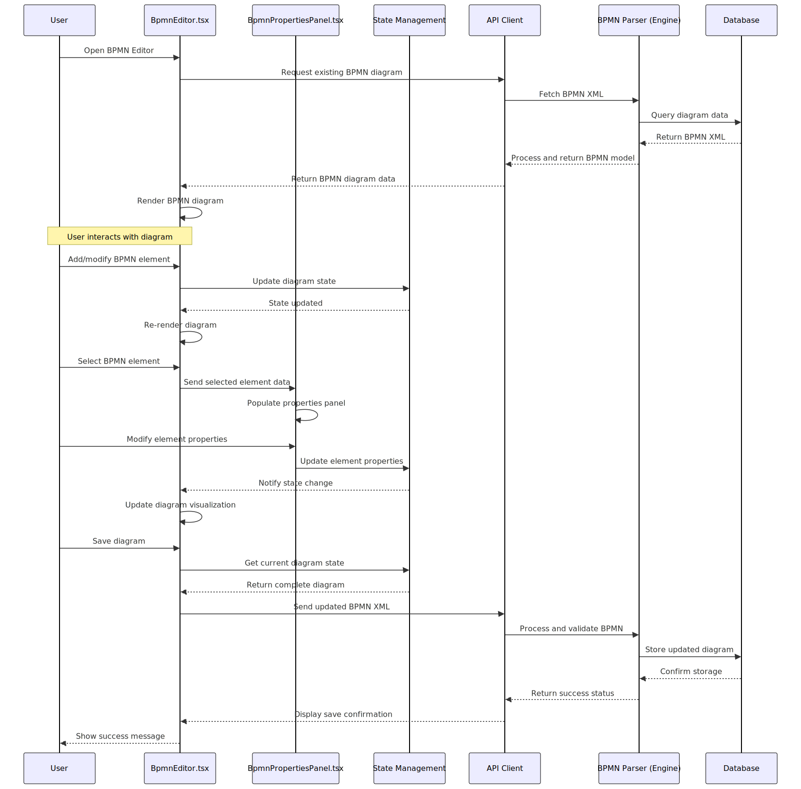
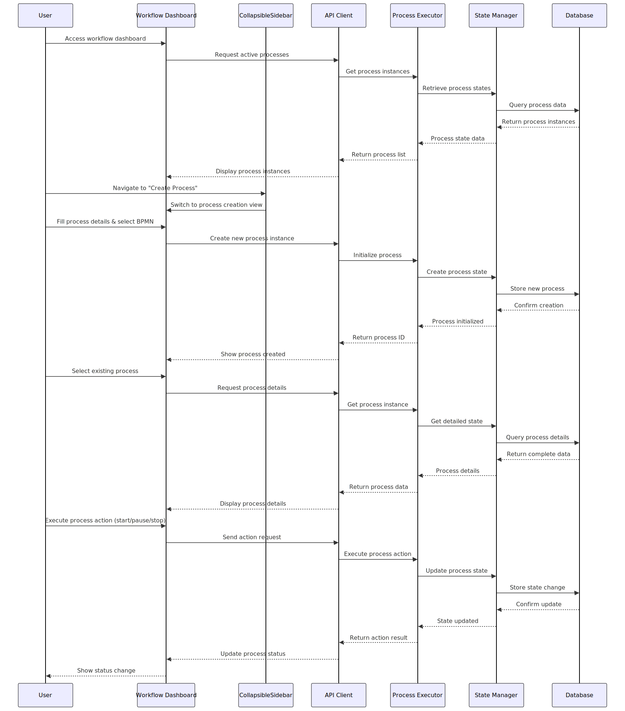

# IGRP Workflow Application Technical Specifications

## 1. Introduction

The IGRP Workflow (IGRP-WF) application is a comprehensive workflow management system designed to model, execute, and monitor business processes using the BPMN 2.0 standard. The application follows a monorepo structure with two main packages:

- **igrp-wf-engine**: The core workflow engine library responsible for process execution, state management, and BPMN parsing
- **igrp-wf-studio-ui**: The React-based UI application providing a visual interface for workflow design and management

This document provides detailed technical specifications for the IGRP-WF application, including architecture diagrams, component relationships, key workflows, and deployment considerations.

## 2. Technology Stack

### 2.1 Frontend (igrp-wf-studio-ui)

- **Framework**: React.js with TypeScript
- **State Management**: Redux with Redux Toolkit
- **UI Components**: Custom components with Tailwind CSS
- **BPMN Modeling**: bpmn-js library
- **API Communication**: Axios
- **Build Tools**: Webpack, Babel
- **Testing**: Jest, React Testing Library

### 2.2 Backend (igrp-wf-engine)

- **Language**: Node.js with TypeScript
- **API Framework**: Express.js
- **Process Execution**: Custom workflow engine
- **BPMN Parsing**: XML processing with custom BPMN parser
- **Database Access**: TypeORM
- **Authentication**: JWT-based authentication
- **Testing**: Jest, Supertest

### 2.3 Database

- **Primary Database**: PostgreSQL
- **Caching**: Redis

## 3. System Architecture

The IGRP-WF application follows a modular architecture with clear separation of concerns between the workflow engine and the user interface.

The system architecture diagram illustrates the relationship between the two main packages:

- **igrp-wf-engine**: Contains the core engine components responsible for process execution, BPMN parsing, state management, and API layer.
- **igrp-wf-studio-ui**: Contains the React UI components including the BPMN editor, properties panel, workflow dashboard, and collapsible sidebar.

The API layer in the engine package serves as the interface between the UI and the core engine functionality. The system also interacts with external systems such as databases and external APIs.

## 4. Component Diagram

The component diagram provides a more detailed view of the main components within each package and their relationships.

### 4.1 UI Components

- **BpmnEditor.tsx**: Provides the visual interface for creating and editing BPMN diagrams
- **BpmnPropertiesPanel.tsx**: Allows users to view and modify properties of BPMN elements
- **CollapsibleSidebar.tsx**: Provides navigation and context-specific options with a collapsible design
- **Dashboard**: Displays an overview of workflow processes and their statuses

### 4.2 Engine Components

- **BPMN Parser**: Processes BPMN XML definitions and converts them to executable models
- **Process Executor**: Manages the runtime execution of workflow processes
- **State Manager**: Handles the state of process instances
- **API Layer**: Provides REST endpoints for the UI to interact with the engine

## 5. Sequence Diagrams

### 5.1 BPMN Diagram Editing Workflow

The following sequence diagram illustrates the workflow for editing BPMN diagrams:

This diagram shows the interaction between the user, UI components, state management, API client, engine, and database during the BPMN editing process. Key steps include:

1. Loading an existing BPMN diagram
2. User interactions with the diagram (adding/modifying elements)
3. Updating element properties through the properties panel
4. Saving the modified diagram

### 5.2 Workflow Process Management

The following sequence diagram illustrates the workflow for managing processes:

This diagram shows the interaction flow for:

1. Accessing the workflow dashboard to view active processes
2. Creating a new process instance
3. Viewing details of an existing process
4. Executing process actions (start/pause/stop)

## 6. Class and Interface Diagram

The class diagram shows the core classes and interfaces in the application and their relationships:

### 6.1 Engine Core Classes

- **WorkflowEngine**: The main entry point for the engine functionality
- **Process**: Represents a workflow process definition
- **ProcessInstance**: Represents a running instance of a process
- **BpmnDefinition**: Contains the BPMN model definition
- **BpmnElement**: Represents individual elements within a BPMN diagram
- **EventBus**: Facilitates communication between components using an event-driven approach

### 6.2 UI Core Classes

- **BpmnEditorComponent**: Manages the BPMN diagram canvas and user interactions
- **BpmnPropertiesPanelComponent**: Handles the display and editing of element properties
- **WorkflowApiClient**: Provides methods for communicating with the engine API

## 7. Data Flow Diagram

The data flow diagram illustrates how data moves through the system:

The diagram shows:

1. User interactions with the UI components
2. Data flow between UI and API layers
3. Authentication and validation of requests
4. Engine internal data flows
5. Data persistence and retrieval
6. Integration with external systems

## 8. Deployment Diagram

The deployment diagram illustrates how the application is deployed in a production environment:

### 8.1 Deployment Architecture

The application is deployed using a containerized approach with the following components:

- **Frontend Container**: Contains the React application, static files, and Nginx web server
- **Backend Container**: Contains the API server, workflow engine, and Redis cache
- **Database Server**: Contains the primary and replica databases
- **Load Balancer**: Distributes traffic to the application servers
- **Monitoring System**: Monitors the health and performance of all components

### 8.2 Scalability Considerations

- Horizontal scaling of frontend and backend containers
- Database replication for read scalability
- Redis caching for improved performance
- Load balancing for traffic distribution

## 9. Design Patterns and Architectural Decisions

### 9.1 Design Patterns

The IGRP-WF application implements several design patterns:

- **Model-View-Controller (MVC)**: Separation of data model, user interface, and control logic
- **Observer Pattern**: Used in the event bus for communication between components
- **Factory Pattern**: Used for creating process instances and BPMN elements
- **Strategy Pattern**: Used for implementing different process execution strategies
- **Repository Pattern**: Used for data access abstraction
- **Singleton Pattern**: Used for the workflow engine and event bus instances

### 9.2 Architectural Decisions

#### 9.2.1 Monorepo Structure

The decision to use a monorepo structure was made to:
- Facilitate code sharing between packages
- Ensure consistent versioning
- Simplify dependency management
- Enable atomic changes across packages

#### 9.2.2 TypeScript

TypeScript was chosen for both frontend and backend to:
- Provide strong typing and better IDE support
- Catch errors at compile time
- Improve code documentation through type definitions
- Enable better refactoring capabilities

#### 9.2.3 BPMN-JS Library

The bpmn-js library was selected for BPMN modeling because:
- It provides a comprehensive implementation of the BPMN 2.0 standard
- It offers a customizable modeling interface
- It has good community support and documentation
- It handles the complexity of BPMN rendering and interaction

#### 9.2.4 Custom Workflow Engine

A custom workflow engine was developed instead of using existing solutions to:
- Provide tighter integration with the IGRP platform
- Enable customization for specific business requirements
- Optimize for the specific use cases of the application
- Maintain control over the execution model

## 10. Recent Improvements

The application has recently undergone several improvements:

### 10.1 BPMN Diagram Editing (BpmnEditor.tsx)

- Enhanced the diagram editing capabilities
- Improved user interaction with BPMN elements
- Fixed rendering issues with complex diagrams
- Added support for additional BPMN element types

### 10.2 BPMN Artifact Properties (BpmnPropertiesPanel.tsx)

- Adjusted the properties panel layout for better usability
- Added validation for property values
- Implemented dynamic property forms based on element type
- Improved the visual feedback for property changes

### 10.3 Collapsible Sidebar with Tailwind CSS

- Implemented a collapsible sidebar for better space utilization
- Used Tailwind CSS for responsive design
- Added smooth transitions for collapse/expand actions
- Improved navigation between different sections of the application

## 11. Conclusion

The IGRP Workflow application provides a comprehensive solution for business process modeling and execution. Its modular architecture, modern technology stack, and user-friendly interface make it a powerful tool for workflow management.

The technical specifications outlined in this document provide a solid foundation for understanding the application's architecture, components, and workflows, enabling efficient development, maintenance, and extension of the system.
