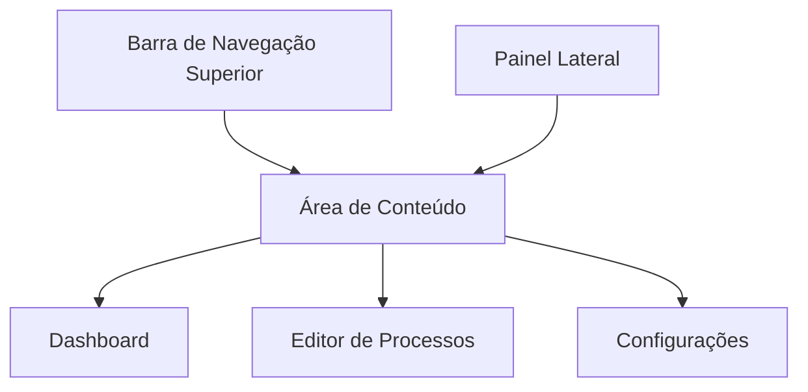
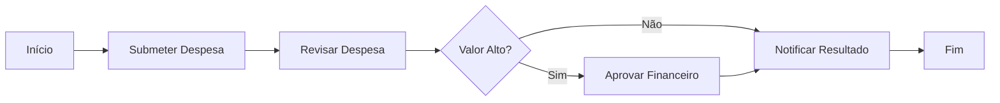
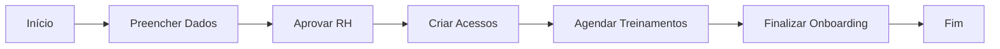
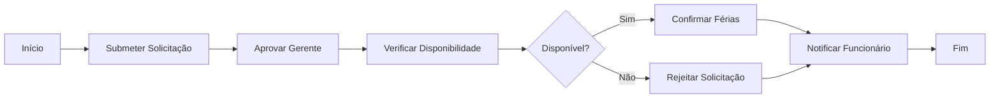
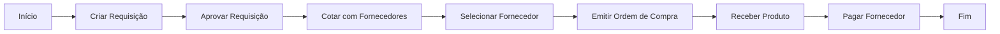

# Manual do Usuário - IGRP-WF

## Índice

1. [Introdução](#introdução)
2. [Primeiros Passos](#primeiros-passos)
3. [Gerenciamento de Workspaces](#gerenciamento-de-workspaces)
4. [Gerenciamento de Áreas e Subáreas](#gerenciamento-de-áreas-e-subáreas)
5. [Gerenciamento de Processos](#gerenciamento-de-processos)
6. [Editor BPMN](#editor-bpmn)
7. [Propriedades do Activiti](#propriedades-do-activiti)
8. [Criação de um Processo de Workflow Completo](#criação-de-um-processo-de-workflow-completo)
9. [Casos de Uso Comuns](#casos-de-uso-comuns)
10. [Solução de Problemas](#solução-de-problemas)

## Introdução

IGRP-WF é um studio de workflow que permite criar e gerenciar workspaces, organizar processos em áreas e definir fluxos de trabalho usando BPMN (Business Process Model and Notation). A aplicação integra-se com o Activiti Runtime Bundle para fornecer recursos avançados de execução de processos de negócios.

Este manual é destinado aos usuários finais que desejam utilizar a aplicação IGRP-WF para criar e gerenciar processos de workflow.

### Principais Recursos

- Criação e gerenciamento de workspaces, áreas, subáreas e processos
- Editor visual de processos BPMN
- Suporte a propriedades do Activiti Runtime Bundle
- Exportação e importação de processos BPMN
- Implantação de processos para execução

## Primeiros Passos

### Acessando a Aplicação

Para acessar a aplicação IGRP-WF, abra seu navegador e acesse o URL fornecido pelo administrador do sistema. Após o carregamento, você verá a tela inicial da aplicação.

### Interface do Usuário

A interface do usuário do IGRP-WF é composta por:

1. **Barra de Navegação Superior**: Contém o logotipo da aplicação, menu de navegação e opções de usuário.
2. **Painel Lateral**: Exibe a estrutura de workspaces, áreas, subáreas e processos.
3. **Área de Conteúdo**: Exibe o conteúdo principal, como o dashboard, editor de processos, etc.

## Gerenciamento de Workspaces

Um workspace (espaço de trabalho) é o contêiner de nível superior que organiza áreas, subáreas e processos relacionados a uma aplicação ou domínio específico.

### Criação de um Novo Workspace

Para criar um novo workspace:

1. Na tela inicial, clique no botão "Novo Workspace".
2. Preencha os campos obrigatórios:
   - **Código**: Identificador único do workspace (apenas letras, números, hífens e sublinhados).
   - **Título**: Nome descritivo do workspace.
   - **Descrição**: Descrição detalhada do propósito do workspace.
   - **Status**: Estado inicial do workspace (Ativo, Inativo ou Rascunho).
3. Clique em "Criar" para finalizar.

### Edição de um Workspace

Para editar um workspace existente:

1. No painel lateral, selecione o workspace desejado.
2. Clique no ícone de engrenagem ou no menu de opções do workspace.
3. Selecione "Editar Workspace".
4. Atualize os campos conforme necessário.
5. Clique em "Salvar" para aplicar as alterações.

### Exclusão de um Workspace

Para excluir um workspace:

1. No painel lateral, selecione o workspace desejado.
2. Clique no ícone de engrenagem ou no menu de opções do workspace.
3. Selecione "Excluir Workspace".
4. Confirme a exclusão quando solicitado.

**Atenção**: A exclusão de um workspace é permanente e removerá todas as áreas, subáreas e processos contidos nele.

## Gerenciamento de Áreas e Subáreas

Áreas e subáreas são utilizadas para organizar processos dentro de um workspace.

### Criação de uma Nova Área

Para criar uma nova área:

1. No painel lateral, selecione o workspace desejado.
2. Clique no botão "Nova Área" ou no ícone de adição.
3. Preencha os campos obrigatórios:
   - **Código**: Identificador único da área.
   - **Título**: Nome descritivo da área.
   - **Descrição**: Descrição detalhada do propósito da área.
   - **Status**: Estado inicial da área (Ativo, Inativo ou Rascunho).
4. Clique em "Criar" para finalizar.

### Criação de uma Nova Subárea

Para criar uma nova subárea:

1. No painel lateral, selecione a área desejada.
2. Clique no botão "Nova Subárea" ou no ícone de adição.
3. Preencha os campos obrigatórios:
   - **Código**: Identificador único da subárea.
   - **Título**: Nome descritivo da subárea.
   - **Descrição**: Descrição detalhada do propósito da subárea.
   - **Status**: Estado inicial da subárea (Ativo, Inativo ou Rascunho).
4. Clique em "Criar" para finalizar.

### Edição e Exclusão de Áreas e Subáreas

O processo de edição e exclusão de áreas e subáreas é semelhante ao de workspaces:

1. Selecione a área ou subárea desejada no painel lateral.
2. Utilize o menu de opções para editar ou excluir.
3. Confirme a operação quando solicitado.

## Gerenciamento de Processos

Processos são definições de fluxos de trabalho criados usando a notação BPMN.

### Criação de um Novo Processo

Para criar um novo processo:

1. No painel lateral, selecione a área ou subárea onde deseja criar o processo.
2. Clique no botão "Novo Processo" ou no ícone de adição.
3. Preencha os campos obrigatórios:
   - **Código**: Identificador único do processo.
   - **Título**: Nome descritivo do processo.
   - **Descrição**: Descrição detalhada do propósito do processo.
   - **Status**: Estado inicial do processo (Ativo, Inativo ou Rascunho).
4. Clique em "Criar" para finalizar.

Após a criação, o processo será aberto automaticamente no editor BPMN.

### Edição de um Processo

Para editar um processo existente:

1. No painel lateral, navegue até o processo desejado.
2. Clique no processo para abri-lo no editor BPMN.

### Exclusão de um Processo

Para excluir um processo:

1. No painel lateral, selecione o processo desejado.
2. Clique no ícone de engrenagem ou no menu de opções do processo.
3. Selecione "Excluir Processo".
4. Confirme a exclusão quando solicitado.

## Editor BPMN

O editor BPMN é a ferramenta principal para definir fluxos de trabalho na aplicação IGRP-WF.

### Interface do Editor

A interface do editor BPMN é composta por:

1. **Barra de Ferramentas Superior**: Contém botões para salvar, exportar e implantar o processo.
2. **Paleta de Elementos**: Exibe os elementos BPMN disponíveis para uso no diagrama.
3. **Área de Desenho**: Área onde o diagrama BPMN é criado e editado.
4. **Painel de Propriedades**: Exibe e permite editar as propriedades do elemento selecionado.

### Elementos BPMN Básicos

O editor suporta os seguintes elementos BPMN básicos:

- **Eventos**: Início, fim, intermediário, etc.
- **Atividades**: Tarefas, subprocessos, etc.
- **Gateways**: Exclusivo, paralelo, inclusivo, etc.
- **Conectores**: Fluxo de sequência, fluxo de mensagem, etc.
- **Artefatos**: Anotações, grupos, etc.

### Criação de um Diagrama BPMN

Para criar um diagrama BPMN:

1. Arraste elementos da paleta para a área de desenho.
2. Conecte os elementos usando os conectores apropriados.
3. Configure as propriedades dos elementos usando o painel de propriedades.
4. Salve o diagrama clicando no botão "Salvar" na barra de ferramentas superior.

### Navegação no Editor

- **Zoom**: Use a roda do mouse ou os botões de zoom na barra de ferramentas.
- **Panorâmica**: Clique e arraste com o botão do meio do mouse ou mantenha a tecla Espaço pressionada enquanto arrasta.
- **Seleção**: Clique em um elemento para selecioná-lo ou arraste para criar uma seleção múltipla.

## Propriedades do Activiti

O editor BPMN do IGRP-WF suporta propriedades específicas do Activiti Runtime Bundle, que permitem configurar o comportamento de execução dos processos.

### Acesso às Propriedades do Activiti

Para acessar as propriedades do Activiti:

1. Selecione um elemento no diagrama BPMN.
2. No painel de propriedades à direita, expanda as seções relacionadas ao Activiti.

### Propriedades Gerais do Activiti

Disponíveis para a maioria dos elementos BPMN:

- **Async**: Define se a atividade deve ser executada de forma assíncrona.
- **Exclusive**: Define se a execução assíncrona deve ser exclusiva.
- **Job Priority**: Define a prioridade do job associado à atividade.

### Propriedades de Tarefas de Serviço

Disponíveis para elementos do tipo "Service Task":

- **Java Class**: Nome completo da classe Java que implementa a tarefa.
- **Expression**: Expressão que resolve para uma implementação de delegado.
- **Delegate Expression**: Expressão que resolve para uma implementação de delegado.
- **Result Variable**: Nome da variável para armazenar o resultado.

### Propriedades de Tarefas de Usuário

Disponíveis para elementos do tipo "User Task":

- **Assignee**: Usuário responsável pela tarefa.
- **Candidate Users**: Lista de usuários candidatos (separados por vírgula).
- **Candidate Groups**: Lista de grupos candidatos (separados por vírgula).
- **Due Date**: Data de vencimento da tarefa (data ISO ou expressão).
- **Priority**: Prioridade da tarefa.
- **Form Key**: Chave do formulário a ser utilizado.

### Propriedades de Call Activity

Disponíveis para elementos do tipo "Call Activity":

- **Called Element Binding**: Tipo de vinculação do processo chamado (latest, deployment, version, versionTag).
- **Called Element Version**: Versão do processo chamado (quando binding=version).
- **Called Element Version Tag**: Tag de versão do processo chamado (quando binding=versionTag).
- **Called Element Tenant ID**: ID do tenant do processo chamado.

### Propriedades de Processo

Disponíveis para o elemento "Process":

- **Candidate Starter Groups**: Grupos que podem iniciar o processo.
- **Candidate Starter Users**: Usuários que podem iniciar o processo.
- **Version Tag**: Tag de versão do processo.
- **History Time To Live**: Tempo de vida do histórico em dias.
- **Is Startable In Tasklist**: Define se o processo pode ser iniciado na lista de tarefas.

### Propriedades de Multi-Instance

Disponíveis para atividades com características de múltiplas instâncias:

- **Async Before**: Execução assíncrona antes da atividade.
- **Async After**: Execução assíncrona após a atividade.
- **Failed Job Retry Time Cycle**: Ciclo de tentativas para jobs falhos (ex: R3/PT10M).

## Criação de um Processo de Workflow Completo

Nesta seção, vamos criar um processo de workflow completo passo a passo.

### Exemplo: Processo de Aprovação de Despesas

Vamos criar um processo de aprovação de despesas com as seguintes etapas:

1. Submissão da despesa
2. Revisão pelo gerente
3. Aprovação pelo financeiro (para despesas acima de um valor limite)
4. Notificação do resultado

#### Passo 1: Criar um Novo Processo

1. Crie um novo workspace chamado "Financeiro" (se ainda não existir).
2. Crie uma área chamada "Despesas" dentro do workspace.
3. Crie um novo processo chamado "AprovacaoDespesas" na área "Despesas".

#### Passo 2: Desenhar o Diagrama BPMN

1. No editor BPMN, adicione um evento de início.
2. Adicione uma tarefa de usuário "SubmeterDespesa" após o evento de início.
3. Adicione uma tarefa de usuário "RevisarDespesa" após "SubmeterDespesa".
4. Adicione um gateway exclusivo "ValorAlto?" após "RevisarDespesa".
5. A partir do gateway, crie dois caminhos:
   - Caminho "Sim": Adicione uma tarefa de usuário "AprovarFinanceiro".
   - Caminho "Não": Conecte diretamente ao próximo passo.
6. Adicione uma tarefa de serviço "NotificarResultado" após ambos os caminhos.
7. Adicione um evento de fim após "NotificarResultado".
8. Conecte todos os elementos com fluxos de sequência.

#### Passo 3: Configurar Propriedades do Activiti

1. Selecione a tarefa "SubmeterDespesa" e configure:
   - **Form Key**: "despesa-form"
   - **Assignee**: "${initiator}"

2. Selecione a tarefa "RevisarDespesa" e configure:
   - **Candidate Groups**: "gerentes"
   - **Due Date**: "PT2D" (2 dias)

3. Selecione o gateway "ValorAlto?" e configure as condições nos fluxos de sequência:
   - Fluxo "Sim": "${despesa.valor > 1000}"
   - Fluxo "Não": "${despesa.valor <= 1000}"

4. Selecione a tarefa "AprovarFinanceiro" e configure:
   - **Candidate Groups**: "financeiro"
   - **Priority**: "50"

5. Selecione a tarefa "NotificarResultado" e configure:
   - **Delegate Expression**: "${notificacaoService}"

#### Passo 4: Salvar e Implantar o Processo

1. Clique no botão "Salvar" para salvar o processo.
2. Clique no botão "Implantar" para implantar o processo no Activiti Runtime Bundle.

### Diagrama do Processo de Aprovação de Despesas

## Casos de Uso Comuns

### Caso 1: Processo de Onboarding de Funcionários

Um processo de onboarding de funcionários pode incluir as seguintes etapas:

1. Preenchimento de dados pessoais
2. Aprovação pelo RH
3. Criação de acessos aos sistemas
4. Agendamento de treinamentos
5. Finalização do onboarding

### Caso 2: Processo de Solicitação de Férias

Um processo de solicitação de férias pode incluir as seguintes etapas:

1. Submissão da solicitação pelo funcionário
2. Aprovação pelo gerente
3. Verificação de disponibilidade pelo RH
4. Confirmação das férias
5. Notificação ao funcionário

### Caso 3: Processo de Compra

Um processo de compra pode incluir as seguintes etapas:

1. Criação da requisição de compra
2. Aprovação da requisição
3. Cotação com fornecedores
4. Seleção do fornecedor
5. Emissão da ordem de compra
6. Recebimento do produto
7. Pagamento ao fornecedor

## Solução de Problemas

### Problemas Comuns e Soluções

#### O editor BPMN não carrega

**Possíveis causas e soluções**:
- Verifique se o navegador está atualizado.
- Limpe o cache do navegador e tente novamente.
- Verifique se há erros no console do navegador (F12).

#### Não é possível salvar um processo

**Possíveis causas e soluções**:
- Verifique se você tem permissões para editar o processo.
- Verifique se o servidor está acessível.
- Verifique se o XML BPMN é válido.

#### Propriedades do Activiti não aparecem no painel de propriedades

**Possíveis causas e soluções**:
- Verifique se o elemento selecionado suporta propriedades do Activiti.
- Verifique se o namespace do Activiti está corretamente definido no XML BPMN.
- Recarregue o editor.

#### Erro ao implantar um processo

**Possíveis causas e soluções**:
- Verifique se o servidor Activiti está em execução.
- Verifique se o XML BPMN é válido.
- Verifique se todas as propriedades obrigatórias estão preenchidas.

### Contato de Suporte

Se você encontrar problemas que não consegue resolver, entre em contato com o suporte técnico:

- Email: suporte@igrp-wf.com
- Telefone: (XX) XXXX-XXXX
- Portal de Suporte: https://suporte.igrp-wf.com

---

Este manual fornece uma visão geral das funcionalidades da aplicação IGRP-WF e como utilizá-las. Para mais informações, consulte a documentação online ou entre em contato com o suporte técnico.
